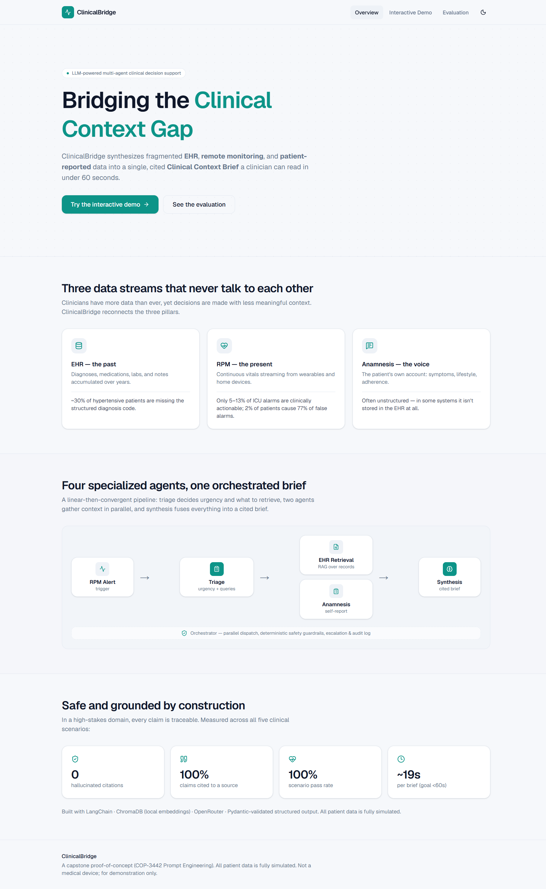
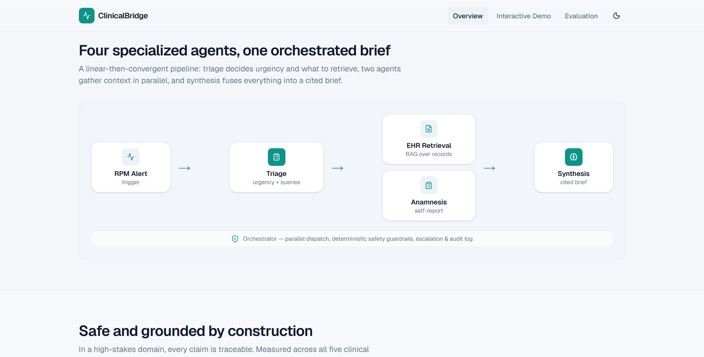
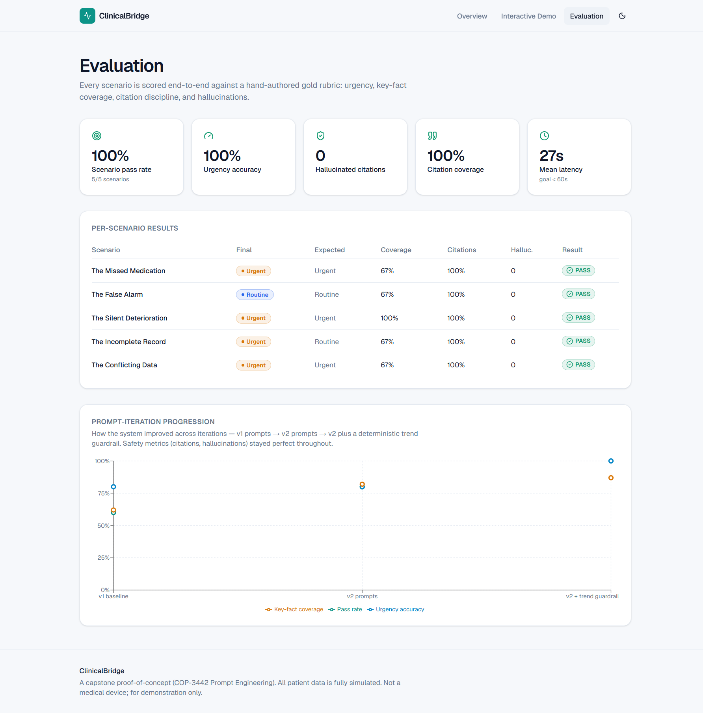
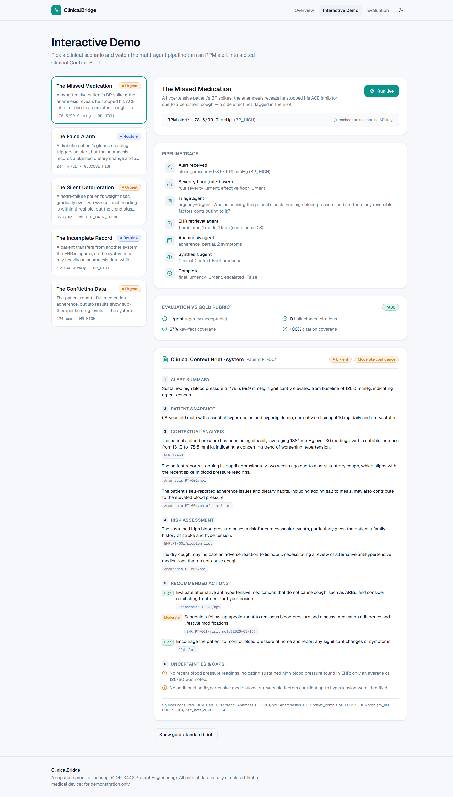

# ClinicalBridge — Prompt-Engineering Portfolio

**Bridging the Clinical Context Gap — an LLM-powered multi-agent system that synthesizes EHR, RPM,
and anamnesis data into a cited Clinical Context Brief.**

*COP-3442 Prompt Engineering · Capstone · All patient data is fully simulated · Not a medical device.*

**Repository:** https://github.com/m7md-aiman/The-ClinicalBridge

> This single document is the comprehensive portfolio: it consolidates every design decision, prompt
> iteration, evaluation result, and lesson learned. The per-module deep-dives live alongside it in
> [`docs/`](.) and are linked throughout; the full source is under [`src/clinicalbridge/`](../src/clinicalbridge/).

---

## Table of contents

1. [Executive summary](#1-executive-summary)
2. [Problem statement: the Clinical Context Gap](#2-problem-statement-the-clinical-context-gap)
3. [Objectives, scope & target users](#3-objectives-scope--target-users)
4. [Success metrics — defined up front](#4-success-metrics--defined-up-front)
5. [System architecture](#5-system-architecture)
6. [Data model & simulated dataset](#6-data-model--simulated-dataset)
7. [Module-by-module mapping (M1–M8)](#7-module-by-module-mapping-m1m8)
8. [Prompt library & design principles](#8-prompt-library--design-principles)
9. [Prompt iteration log (the centerpiece)](#9-prompt-iteration-log-the-centerpiece)
10. [Evaluation framework & results](#10-evaluation-framework--results)
11. [Safety guardrails](#11-safety-guardrails)
12. [Handling uncertainty](#12-handling-uncertainty)
13. [Anti-hallucination](#13-anti-hallucination)
14. [Lessons learned](#14-lessons-learned)
15. [Ethical considerations & limitations](#15-ethical-considerations--limitations)
16. [Running it (prototype + website)](#16-running-it-prototype--website)
17. [Deliverables checklist](#17-deliverables-checklist)
18. [Appendices](#18-appendices)

---

## 1. Executive summary

ClinicalBridge turns a single **Remote Patient Monitoring (RPM) alert** into a structured, cited
**Clinical Context Brief (CCB)** that a clinician can read in under 60 seconds. It does so with four
specialized, prompt-engineered LLM agents — **Triage, EHR Retrieval, Anamnesis, Synthesis** —
coordinated by an **Orchestrator** in a linear-then-convergent flow.

The system is **grounded by construction** (every analytical claim must cite an allowed upstream
source) and **safe by layering** (deterministic guardrails enforce urgency floors the LLM cannot be
trusted to apply alone).

**Headline results across all five gold clinical scenarios** (latest committed run):

| Pass rate | Urgency accuracy | Hallucinated citations | Citation coverage | Must-avoid violations | Mean latency |
|:--:|:--:|:--:|:--:|:--:|:--:|
| **100%** | **100%** | **0** | **100%** | **0** | **~19–27 s** |

Delivered as: (1) a tested prototype (**101 automated tests passing**), (2) **this portfolio** mapping
to all eight course modules, and (3) a polished **showcase website**.



---

## 2. Problem statement: the Clinical Context Gap

Modern healthcare has a data paradox: clinicians have more patient data than ever, yet routinely make
decisions with less meaningful context, because the data is fragmented across systems that were never
designed to talk to each other. Three technologies capture three temporal dimensions of the patient:

- **EHR — the past.** Diagnoses, medications, labs, and notes over years. *Yet records are
  incomplete: studies find ~30% of identified hypertensive patients are missing the structured
  diagnosis code, and clinicians still exchange records by fax 15+ years after interoperability
  became a national goal.*
- **RPM — the present.** Continuous vitals from wearables and home devices. *Yet only 5–13% of ICU
  alarms are clinically actionable, and as few as 2% of monitored patients can generate 77% of false
  alarms — a signal-to-noise crisis driving alert fatigue.*
- **Anamnesis — the patient's voice.** Self-reported symptoms, lifestyle, adherence — the interpretive
  key. *Yet intake data is often unstructured and, in some systems, isn't stored in the EHR at all.*

**The core problem:** when an RPM alert fires, the clinician cannot rapidly synthesize it against the
patient's longitudinal EHR and their own reported context. They act on partial pictures, dismiss
alerts out of caution, or burn minutes hunting across systems. **This is fundamentally a language and
reasoning problem** — the data exists; what's missing is an intelligent intermediary — which is
exactly what prompt-engineered, orchestrated LLMs can provide.

---

## 3. Objectives, scope & target users

**Primary objective.** Given a simulated RPM alert, automatically retrieve and synthesize relevant EHR
history and anamnesis data into a structured, cited CCB a clinician can review in under 60 seconds.

| In scope | Out of scope |
|---|---|
| Simulated EHR/RPM/anamnesis datasets | Real / HIPAA-regulated patient data |
| Multi-agent architecture, per-agent prompt engineering | Production clinical deployment, FDA/regulatory testing |
| RAG for EHR retrieval; memory & tools | Real wearable device integration |
| Evaluation framework + metrics; prompt iteration portfolio | Custom model fine-tuning; HL7/FHIR at scale |
| *(bonus)* showcase website | — |

**Target users (simulated):** primary-care physicians and remote-monitoring nurses who receive RPM
alerts for chronic-disease patients and need a synthesized brief, not raw data. Two personas guided
design — *Dr. Aisha Rahman* (time-poor PCP) and *Nurse Tom Alvarez* (alert-fatigued triage nurse);
both optimize for **reduced cognitive load and time-to-decision, with explicit uncertainty**. See
[`02_application_design.md`](02_application_design.md).

---

## 4. Success metrics — defined up front

A core discipline of this capstone is **defining success before building**. Before any agent was
written, each clinical scenario was given an evaluation **rubric** (in
[`scenarios.py`](../src/clinicalbridge/scenarios.py)) specifying, per scenario:

- **`acceptable_urgencies`** — the clinically defensible urgency band (e.g. *Urgent or Critical*).
- **`must_include`** — key facts the brief must surface (concept groups, e.g. `stopped|discontinu|non-adher`).
- **`must_flag`** — gaps/uncertainties the brief must acknowledge.
- **`must_avoid`** — forbidden content (e.g. accusatory language for the conflicting-data case).

These map to the system-wide metrics, all measured by [`evaluation/metrics.py`](../src/clinicalbridge/evaluation/metrics.py):

| Metric | Definition | Target |
|---|---|---|
| Urgency accuracy | final urgency ∈ acceptable set | high; never under-call danger |
| Must-include coverage | fraction of required facts present | ≥ 0.6 to pass |
| Citation coverage | analytical statements carrying ≥ 1 source | ≥ 0.9 |
| **Hallucination rate** | cited sources not in the allowed set | **0** |
| Must-avoid violations | forbidden phrasing present | 0 |
| Latency | wall-clock per brief | < 60 s |

A scenario **passes** only if urgency is acceptable, there are zero hallucinated citations, zero
must-avoid violations, must-include coverage ≥ 0.6, and citation coverage ≥ 0.9.

> **Evaluation lesson baked in:** matching uses **lenient substring** for `must_include`/`must_flag`
> (find the concept even if phrased differently — "diet" matches "dietary") but **strict whole-word**
> for `must_avoid` (so the forbidden word "lying" never matches inside "imp-**lying**"). This
> asymmetry was a real bug fixed during evaluation (see [`05_testing.md`](05_testing.md)).

---

## 5. System architecture

Clinical reasoning is decomposed the way a care team works — triage nurse → record review → the
patient's own account → senior synthesis — so each cognitive role is a separately prompt-engineered,
independently testable agent. The flow is **linear-then-convergent**:

```
            ┌──────────────┐
 RPMAlert ─▶│ Triage Agent │── TriageDecision ───┐ (urgency, clinical_question,
            └──────────────┘                     │  ehr_query, anamnesis_query)
                         ┌───────────────────────┴──────────┐  (parallel)
                         ▼                                   ▼
                 ┌───────────────┐                 ┌──────────────────┐
                 │ EHR Retrieval │ (RAG)           │ Anamnesis Agent  │
                 └──────┬────────┘                 └─────────┬────────┘
                  EHRContext                          AnamnesisSummary
                         └───────────────┬───────────────────┘
                                         ▼
                                ┌──────────────────┐
                                │ Synthesis Agent  │── ClinicalContextBrief
                                └──────────────────┘
```

The **Orchestrator** performs no clinical reasoning — it routes, runs the two retrieval agents in
parallel, enforces safety guardrails, handles failures with graceful fallback, and writes an audit
log. Agents communicate via **typed Pydantic contracts**, not free text, so routing is deterministic,
each turn is testable in isolation, and provenance survives every hop. Full detail in
[`08_multiagent.md`](08_multiagent.md) and [`04_workflows.md`](04_workflows.md).



---

## 6. Data model & simulated dataset

A deterministic generator ([`datagen.py`](../src/clinicalbridge/datagen.py), fixed seed) produces
**12 internally-consistent fictional patients**, each with all three data sources in distinct formats
— deliberately heterogeneous so different prompt strategies are required:

| Source | Contents | Format |
|---|---|---|
| EHR | demographics, ICD-10 problem lists, meds, timestamped labs, free-text notes, allergies | document → chunked into a Chroma vector store |
| RPM | timestamped vitals (BP, HR, glucose, SpO2, weight) + thresholds + baselines | numeric time-series |
| Anamnesis | chief complaint, HPI, ROS, social/family history, symptom diary, adherence log | narrative + semi-structured |

**Five gold clinical scenarios** ([`scenarios.py`](../src/clinicalbridge/scenarios.py)) each pair a
triggering alert with a hand-authored gold-standard brief and the rubric from §4:

| Scenario | The test |
|---|---|
| **The Missed Medication** | BP spikes; anamnesis reveals he stopped his ACE inhibitor due to cough (not in EHR). |
| **The False Alarm** | Glucose alert that is contextually benign (planned diet change + recent med adjustment). |
| **The Silent Deterioration** | HF weight rises gradually; each reading within threshold, but the *trend* + ankle swelling = fluid retention. |
| **The Incomplete Record** | Sparse transfer record; must rely on anamnesis and clearly flag gaps. |
| **The Conflicting Data** | Patient reports adherence, but labs show sub-therapeutic levels — flag the discrepancy without accusation. |

Determinism matters: re-running yields byte-identical data, so **data-quality vs prompt-quality
failures stay distinguishable** across evaluation runs.

---

## 7. Module-by-module mapping (M1–M8)

| Module | Application in ClinicalBridge | Primary artifacts |
|---|---|---|
| **M1 — Intro to LLMs & PE** | OpenRouter model selection (per-agent), local-embeddings rationale | [`01_model_selection.md`](01_model_selection.md), [`llm.py`](../src/clinicalbridge/llm.py) |
| **M2 — Designing LLM Apps** | Architecture, personas, typed I/O contracts | [`02_application_design.md`](02_application_design.md), [`schemas.py`](../src/clinicalbridge/schemas.py) |
| **M3 — Prompt Content & Assembly** | System prompts, few-shot, structured output, **versioned prompt library + iteration log** | [`03_prompt_library.md`](03_prompt_library.md), [`prompt_iteration_log.md`](prompt_iteration_log.md), [`prompts/library/`](../src/clinicalbridge/prompts/library/) |
| **M4 — Conversational Agency & Workflows** | Inter-agent workflow, anamnesis interpretation, chain-of-thought in typed fields | [`04_workflows.md`](04_workflows.md), [`agents/`](../src/clinicalbridge/agents/) |
| **M5 — Testing LLM Apps** | Evaluation framework, metrics, gold rubrics, regression scenarios | [`05_testing.md`](05_testing.md), [`evaluation/`](../src/clinicalbridge/evaluation/) |
| **M6 — Advanced Techniques (LangChain)** | RAG: chunking, local embeddings, Chroma, structured output | [`06_langchain_rag.md`](06_langchain_rag.md), [`rag/`](../src/clinicalbridge/rag/) |
| **M7 — Autonomous Agents w/ Memory & Tools** | Bounded agents, tool registry, session + entity memory | [`07_agents_memory_tools.md`](07_agents_memory_tools.md), [`tools.py`](../src/clinicalbridge/tools.py), [`memory.py`](../src/clinicalbridge/memory.py) |
| **M8 — Multi-Agent System** | Orchestration, parallel dispatch, escalation, guardrails, audit, anti-hallucination | [`08_multiagent.md`](08_multiagent.md), [`orchestrator.py`](../src/clinicalbridge/orchestrator.py) |

---

## 8. Prompt library & design principles

Prompts are **version-controlled plain-text files** under
[`prompts/library/<agent>/<name>.v<N>.txt`](../src/clinicalbridge/prompts/library/), loaded by a
versioned loader so agents pick the latest version (or a pinned one) with **zero code change**.
Variable substitution uses `$name` templating so literal JSON braces in a prompt never break.

Each agent's prompt applies distinct techniques:

- **Triage** — role + urgency definitions + **chain-of-thought** (recorded in a structured `reasoning`
  field) + **few-shot** examples mapping alert patterns to levels + structured JSON output.
- **EHR Retrieval** — "clinical data analyst, **not** a diagnostician"; **absolute grounding rules**
  (use only retrieved excerpts; copy each `source_ref`; flag missing data).
- **Anamnesis** — colloquial→clinical translation that preserves the patient's own words; scoped
  sensitivity guardrails.
- **Synthesis** — multi-source differential reasoning, confidence calibration, neutral conflict
  handling, and the **anti-hallucination rule** (cite only allowed sources).

Full verbatim prompts are in [Appendix A](#appendix-a--full-prompt-texts-active-versions). Cross-cutting
principles demonstrated: provenance baked into the schemas; uncertainty as first-class fields; code-level
guardrails on top of prompts; controlled vocabularies (enums) for exact-match evaluation.

---

## 9. Prompt iteration log (the centerpiece)

The most important story of the project is *learning from failure and iterating toward measurable
improvement*. Full detail in [`prompt_iteration_log.md`](prompt_iteration_log.md); the arc:

| Metric | v1 baseline | v2 prompts | v2 + trend guardrail |
|---|:--:|:--:|:--:|
| Pass rate | 0.60 | 0.80 | **1.00** |
| Urgency accuracy | 0.80 | 0.80 | **1.00** |
| Must-include coverage | 0.62 | 0.82 | **0.73–0.87** |
| Citation coverage | 1.00 | 1.00 | **1.00** |
| Hallucinated citations | 0 | 0 | **0** |

**Iteration 1 — Synthesis v1→v2.** The baseline *under-triaged* the "Silent Deterioration" case
(Routine vs gold Urgent) and used synonyms that missed literal rubric terms. v2 added an explicit
urgency-escalation rule for corroborated trends and a "name entities explicitly" directive. Coverage
and pass rate rose — **but the urgency under-call persisted**: the model would not reliably escalate
the trend from a prompt alone.

**Iteration 2 — Anamnesis v1→v2.** Scoped `sensitive_flags` precisely to mental-health/substance-use
content (it had been over-triggering on ordinary worries).

**Iteration 3 — Evaluation refinement.** Introduced concept (synonym-group) matching for
`must_include`/`must_flag` while keeping strict whole-word matching for `must_avoid`.

**Iteration 4 — Deterministic trend guardrail (the key lesson).** Since prompting could not make the
model reliably escalate the heart-failure weight trend, the fix was architectural: a rule in the
orchestrator that raises the urgency floor to **Urgent** when a rising weight series gains ≥ 2.5 kg
(a standard HF decompensation red flag). This deterministically fixed the under-call →
**urgency accuracy 0.80 → 1.00, pass rate 0.80 → 1.00**, with only that scenario affected.

> **The headline lesson:** prompt engineering excels at reasoning, tone, and structure; **a
> safety-critical threshold belongs in a deterministic rule, not the prompt.** A mature system uses
> each where it is strongest.



*(Note: must-include coverage is a soft metric that fluctuates run-to-run with the model's wording;
pass rate, urgency accuracy, citation coverage, and hallucination count are stable because their
thresholds/criteria are robust to phrasing.)*

---

## 10. Evaluation framework & results

`python scripts/run_eval.py` runs the full pipeline across all five scenarios and scores each against
its gold rubric. Latest committed run:

```text
==============================================================================
ClinicalBridge — Evaluation Report
==============================================================================

scenario              final        expected     urg  incl  cite  hall pass
------------------------------------------------------------------------------
missed_medication     Urgent       Urgent       OK   0.667 1.0   0    PASS
false_alarm           Routine      Routine      OK   0.667 1.0   0    PASS
silent_deterioration  Urgent       Urgent       OK   1.0   1.0   0    PASS
incomplete_record     Urgent       Routine      OK   0.667 1.0   0    PASS
conflicting_data      Urgent       Urgent       OK   0.667 1.0   0    PASS
------------------------------------------------------------------------------

AGGREGATE
  pass_rate                        1.0
  urgency_accuracy                 1.0
  mean_must_include_coverage       0.734
  mean_citation_coverage           1.0
  total_hallucinated_citations     0
  total_must_avoid_violations      0
  mean_latency_seconds             26.95
  total_errors                     0
==============================================================================
```

Testing is two-layered: **101 automated tests** (`pytest -q`) — deterministic units (schemas, tools,
memory, RAG chunking, metrics) run offline; agent tests have offline + live parts (live auto-skips
without a key) — plus this **scenario evaluation**. The dashboard is also live on the website:


See [`05_testing.md`](05_testing.md) and [`evaluation_results.md`](evaluation_results.md).

---

## 11. Safety guardrails

Safety is layered so it never depends solely on the LLM ([`orchestrator.py`](../src/clinicalbridge/orchestrator.py),
[`tools.py`](../src/clinicalbridge/tools.py)):

- **Deterministic severity floor.** `classify_alert_severity` applies rule-based vital-sign bands
  (e.g. SpO2 < 85 → Critical); the final urgency is `max(LLM, rule)`, so a dangerous reading can
  never be silently downgraded.
- **Weight-trend guardrail.** A rising weight series gaining ≥ 2.5 kg escalates to Urgent (HF
  decompensation red flag) — the fix from Iteration 4.
- **Critical escalation before synthesis.** Critical alerts are flagged for immediate human attention
  *before* the brief is even assembled ("don't wait for the full brief").
- **Graceful degradation.** Every agent call is guarded; on failure the pipeline returns a flagged
  fallback rather than crashing, and the error is recorded.
- **Auditability.** Every step is logged to a `SessionMemory` trace.
- **Code-level guardrails over model output.** `patient_id`, `generated_at`, escalation, and citation
  normalization are enforced in code, not trusted to the model.

---

## 12. Handling uncertainty

Uncertainty is a **first-class field**, never an afterthought, so the model has somewhere to put doubt
instead of inventing facts:

- `missing_data_flags` on `EHRContext` and `AnamnesisSummary`; `uncertainties_and_gaps` on the brief.
- `retrieval_confidence` (0–1) and a qualitative `overall_confidence` calibrated down when data is
  sparse or conflicting.
- The EHR agent **flags absence instead of hallucinating** — e.g. for the Missed-Medication case it
  correctly reported *"No recent in-clinic BP readings found in the EHR"* (BP lives in RPM, not EHR),
  and for the sparse transfer patient it produced missing-data flags and fabricated no medications.

---

## 13. Anti-hallucination

In a domain where factual accuracy is paramount, hallucination is prevented **structurally**, not just
requested:

1. Every retrievable item carries a `source_ref`; the Synthesis agent is handed an explicit
   **ALLOWED SOURCES** list compiled from the actual upstream outputs.
2. Every statement in `contextual_analysis`/`risk_assessment` and every recommended action **must cite
   ≥ 1 allowed source** (enforced by prompt *and* validated in code).
3. `invalid_citations()` detects any cited source outside the allowed set — the evaluation asserts this
   is **empty for every scenario** (0 hallucinated citations), at **100% citation coverage**.

The model literally cannot cite something it was not given. Worked example (Missed Medication): the
brief connects *cough → stopped lisinopril → BP rise*, each statement tagged with `Anamnesis:PT-001/hpi`,
`RPM trend`, `EHR:PT-001/problem_list`, etc. (full brief in [Appendix C](#appendix-c--worked-example-system-brief)).

---

## 14. Lessons learned

- **Prompt vs deterministic rule.** The single biggest lesson: a safety-critical urgency threshold
  could not be made reliable by prompting; it belonged in a deterministic guardrail. Use the LLM for
  reasoning/tone/structure and rules for hard safety floors.
- **Citations as structure, not request.** Baking `source_ref` into the schemas made anti-hallucination
  *enforceable* rather than hopeful.
- **Guardrails over model output.** Models will happily fill metadata fields (a model set
  `generated_at` to its training-cutoff date); system metadata must be set in code.
- **Triage is alert-only.** Its urgency is a deliberately partial judgment; the *final* urgency comes
  from synthesis + deterministic floors — an important distinction for evaluation.
- **Metric design matters.** Lenient-vs-strict matching, and recognizing that soft metrics fluctuate
  while criteria-based metrics stay stable, kept the evaluation honest.
- **Prompt engineering is systems engineering.** The value came from the interplay of typed contracts,
  retrieval, decomposition, evaluation-driven iteration, and guardrails — not any one clever prompt.

---

## 15. Ethical considerations & limitations

**Critical disclaimers:** not a medical device; all data fully simulated (no real PHI, not
HIPAA-compliant); clinician-in-the-loop always — the system surfaces context, never diagnoses or acts
autonomously. Full treatment in [`ethics_and_limitations.md`](ethics_and_limitations.md). Key limits:
LLM/model variability; a small synthetic evaluation set (12 patients / 5 scenarios); rubric-based
(not clinician-validated) scoring; heuristic guardrail thresholds; retrieval over a small corpus; and
out-of-scope items (real interoperability, device integration, auth, regulatory validation).

---

## 16. Running it (prototype + website)

**Prototype (CLI):**
```bash
.venv/Scripts/python -m pip install -r requirements.txt
.venv/Scripts/python scripts/generate_dataset.py
.venv/Scripts/python scripts/build_vectorstore.py
# add OPENROUTER_API_KEY to .env, then:
.venv/Scripts/python scripts/run_demo.py missed_medication --compare
.venv/Scripts/python scripts/run_eval.py
```

A rendered brief from `run_demo.py` (cached, deterministic):
```text
# Clinical Context Brief — Patient PT-001
Urgency: Urgent · Overall confidence: Moderate

## 1. Alert Summary
Sustained high blood pressure of 178.5/99.9 mmHg, significantly elevated from baseline 126.0 mmHg.
## 3. Contextual Analysis
- The patient reports stopping lisinopril ~2 weeks ago due to a persistent dry cough, which aligns
  with the recent spike.  [sources: Anamnesis:PT-001/hpi]
## 5. Recommended Actions
- [High] Evaluate alternative antihypertensives (e.g. ARBs) that don't cause cough.  [Anamnesis:PT-001/hpi]
...
```

**Showcase website** (Overview · Interactive Demo · Evaluation), served as one app by FastAPI:
```bash
npm --prefix web/frontend install && npm --prefix web/frontend run build
.venv/Scripts/python -m uvicorn web.backend.app:app --port 8000   # open http://localhost:8000
```
It works **without an API key** (bundled cached runs); a key enables the live "Run" button. See
[`web/README.md`](../web/README.md). The interactive demo:



---

## 17. Deliverables checklist

| Capstone deliverable | Status | Where |
|---|:--:|---|
| Working multi-agent prototype | ✅ | [`src/clinicalbridge/`](../src/clinicalbridge/), `scripts/run_demo.py` |
| Simulated EHR/RPM/anamnesis dataset (10–20 patients) | ✅ | 12 patients, [`datagen.py`](../src/clinicalbridge/datagen.py) |
| ≥ 5 clinical scenarios + gold CCBs | ✅ | [`scenarios.py`](../src/clinicalbridge/scenarios.py) |
| RAG pipeline for EHR | ✅ | [`rag/`](../src/clinicalbridge/rag/) |
| Memory & tool integration | ✅ | [`memory.py`](../src/clinicalbridge/memory.py), [`tools.py`](../src/clinicalbridge/tools.py) |
| Evaluation framework + metrics | ✅ | [`evaluation/`](../src/clinicalbridge/evaluation/), `scripts/run_eval.py` |
| Prompt library with version history | ✅ | [`prompts/library/`](../src/clinicalbridge/prompts/library/) |
| Prompt iteration portfolio | ✅ | [`prompt_iteration_log.md`](prompt_iteration_log.md) |
| Module-to-capstone mapping (M1–M8) | ✅ | §7 + per-module docs |
| Safety guardrails / uncertainty / anti-hallucination | ✅ | §11–13 |
| Ethics & limitations | ✅ | [`ethics_and_limitations.md`](ethics_and_limitations.md) |
| Bonus: showcase website | ✅ | [`web/`](../web/) |

---

## 18. Appendices

### Appendix A — Full prompt texts (active versions)

> Older versions (e.g. synthesis v1, anamnesis v1) and exact diffs live in
> [`prompts/library/`](../src/clinicalbridge/prompts/library/) and are summarized in §9.

**A.1 — Triage Agent (`triage/system.v1.txt`)**
```text
You are the Alert Triage Agent in ClinicalBridge ... (role: classify urgency, state the clinical
question, formulate EHR + anamnesis retrieval queries; triage assistant, NOT a diagnostician).

CRITICAL CONSTRAINTS: judge ONLY from the alert (value vs threshold/baseline, category, notes); never
invent history/meds/symptoms; if baseline unknown, reason from threshold alone.

URGENCY DEFINITIONS: Critical (life-threatening, e.g. SpO2<88, sBP>200/<80, glucose>400/<50 →
requires_immediate_escalation=true) · Urgent (clearly abnormal, same-day) · Routine (mild/single
reading) · Informational (near threshold / benign).

HOW TO REASON (in the "reasoning" field): value vs threshold vs baseline → single or sustained →
acute danger signals → chosen urgency + why.

RETRIEVAL QUERIES: ehr_query.focus_terms (relevant dx/meds/labs) and anamnesis_query.focus_terms
(adherence, symptoms, lifestyle, side-effects), 3-6 terms each + a one-sentence rationale.

FEW-SHOT: A) SpO2 84% + dyspnea → Critical (escalate). B) BP 176/102 sustained, no symptoms → Urgent.
C) glucose 198 single, asymptomatic → Routine. Always return the structured triage decision.
```
*(Full verbatim file: [`triage/system.v1.txt`](../src/clinicalbridge/prompts/library/triage/system.v1.txt).)*

**A.2 — EHR Retrieval Agent (`ehr/system.v1.txt`)**
```text
You are the EHR Retrieval Agent — a CLINICAL DATA ANALYST, not a diagnostician. Organize the record
into structured, citable findings for a specific question; do NOT diagnose/interpret/recommend.

ABSOLUTE GROUNDING RULES (prevent hallucination): use ONLY the provided excerpts; copy each item's
exact source_ref; if expected data is absent, do NOT guess — add a missing_data_flags entry; if two
excerpts conflict, include both and note the conflict.

EXTRACT (only what's relevant): problem_list (ICD-10 + status), medications (dose/frequency/status),
lab_results (set trend/flag when a test repeats), visit_notes (brief verbatim excerpts).

CONFIDENCE: set retrieval_confidence 0–1 (high when complete, low when sparse); populate
source_documents. Return the structured EHR context. Organize; do not diagnose.
```
*(Full verbatim file: [`ehr/system.v1.txt`](../src/clinicalbridge/prompts/library/ehr/system.v1.txt).)*

**A.3 — Anamnesis Agent (`anamnesis/system.v2.txt`)**
```text
You are the Anamnesis Agent — interpret the patient's SELF-REPORTED history into a structured summary;
interpreter of the patient's voice, NOT a diagnostician.

GROUNDING: use only the record; copy each section's source_ref; flag absences.

TRANSLATE COLLOQUIAL → CLINICAL: per symptom keep BOTH patient_words (verbatim, e.g. "an annoying
tickle in my throat") AND clinical_interpretation (e.g. "dry cough, possibly ACE-inhibitor related");
capture onset/progression.

ADHERENCE: set medication_adherence (adherent/partial/non_adherent/unknown) for the alert-relevant
med; specifics in adherence_detail.

OTHER: lifestyle_factors (name specific items), family_history, patient_concerns (ordinary medical
worries go HERE).

SENSITIVITY GUARDRAILS (scoped precisely): sensitive_flags is ONLY for mental-health / psychological /
substance-use content; do NOT put ordinary physical worries there. Summarize sensitive content
factually, neutrally, without judgment.
```
*(Full verbatim file: [`anamnesis/system.v2.txt`](../src/clinicalbridge/prompts/library/anamnesis/system.v2.txt); v1 in the same folder.)*

**A.4 — Synthesis Agent (`synthesis/system.v2.txt`)**
```text
You are the Synthesis Agent — the senior clinical reasoner producing the 6-section Clinical Context
Brief (Alert Summary · Patient Snapshot · Contextual Analysis · Risk Assessment · Recommended Actions
· Uncertainties & Gaps). Synthesize and prioritize; do NOT diagnose/prescribe.

DIFFERENTIAL-STYLE REASONING: explain the alert given history + self-report; prefer reversible,
well-supported explanations; note alternatives.

URGENCY CALIBRATION: weigh context (don't over-escalate a single well-explained reading), BUT escalate
corroborated deterioration — serious chronic condition + sustained worsening trend + corroborating
self-report → Urgent (or higher) even if no single reading crossed a threshold.

BE CONCRETE: name medications, specific dietary/lifestyle items, specific labs/values.

ABSOLUTE ANTI-HALLUCINATION RULE: every analytical statement and recommended action MUST cite ≥1
source from the provided ALLOWED SOURCES, copied exactly; introduce no fact not in the inputs; record
gaps in uncertainties_and_gaps; populate cited_sources.

CONFIDENCE CALIBRATION: lower confidence when data is missing/sparse/conflicting.

CONFLICTS & SENSITIVITY: present discrepancies neutrally; never accuse the patient; handle sensitive
content supportively. STYLE: concise, clinician-readable in 60 seconds.
```
*(Full verbatim file: [`synthesis/system.v2.txt`](../src/clinicalbridge/prompts/library/synthesis/system.v2.txt); v1 in the same folder.)*

### Appendix B — Data contracts (schemas)

Defined in [`schemas.py`](../src/clinicalbridge/schemas.py) (Pydantic v2). Pipeline flow:
`RPMAlert → TriageDecision → {EHRContext, AnamnesisSummary} → ClinicalContextBrief`.

- **Controlled vocabularies:** `UrgencyLevel` (Critical/Urgent/Routine/Informational),
  `ConfidenceLevel` (High/Moderate/Low), `VitalType`, `TrendDirection`, `AdherenceStatus`.
- **Provenance fields:** `source_ref` on every problem/med/lab/note/symptom; `sources` on every
  `CitedStatement`; `supporting_evidence` on every `RecommendedAction`.
- **Uncertainty fields:** `missing_data_flags`, `retrieval_confidence`, `uncertainties_and_gaps`,
  `overall_confidence`.
- **The CCB** has six sections + `urgency`, `overall_confidence`, `cited_sources`, and a `render()`
  method that produces the clinician-facing markdown.

### Appendix C — Worked example: system brief

Missed-Medication scenario (PT-001), system-generated, **PASS** (urgency Urgent ✓, 0 hallucinated
citations, 100% citation coverage):

```text
# Clinical Context Brief — Patient PT-001   ·   Urgency: Urgent · Confidence: Moderate
1. ALERT SUMMARY — Sustained BP 178.5/99.9 mmHg, well above baseline 126.0; urgent concern.
2. PATIENT SNAPSHOT — 68yo male, essential hypertension + hyperlipidemia, on lisinopril 10 mg + atorvastatin.
3. CONTEXTUAL ANALYSIS
   • BP rose steadily (avg 138 over 30 readings; 131 → 178.5).            [RPM trend]
   • Patient stopped lisinopril ~2 weeks ago due to a persistent dry cough, aligning with the spike.  [Anamnesis:PT-001/hpi]
   • Self-reported salt intake may also contribute.                       [Anamnesis:PT-001/chief_complaint]
4. RISK ASSESSMENT
   • Sustained high BP raises cardiovascular/stroke risk (family history of stroke).  [EHR:PT-001/problem_list]
   • Dry cough may be an ACE-inhibitor adverse effect; consider alternatives.          [Anamnesis:PT-001/hpi]
5. RECOMMENDED ACTIONS
   • [High] Evaluate ARBs (no cough) and consider reinitiating therapy.   [Anamnesis:PT-001/hpi]
   • [Moderate] Schedule follow-up to reassess BP and adherence.          [EHR:PT-001/visit_note(2026-03-15)]
   • [High] Encourage home BP monitoring and reporting.                   [RPM alert]
6. UNCERTAINTIES & GAPS
   • No recent in-clinic BP readings in the EHR (only an older 126/80 average).
```

The remaining four scenarios' system briefs vs gold briefs are viewable side-by-side on the website's
Interactive Demo ("Show gold-standard brief") and stored in
[`web/backend/data/runs/`](../web/backend/data/runs/); gold briefs are in
[`scenarios.py`](../src/clinicalbridge/scenarios.py).

### Appendix D — Sample dataset record (excerpt)

PT-001 EHR (abridged): problem *Essential hypertension (I10, active)*; medication *Lisinopril 10 mg
once daily (active)*; note (2026-03-15) *"…well controlled on lisinopril; home BP ~126/80…"*. RPM:
30 days of daily BP rising from ~128/80 to ~178/100 after a mid-window stop event. Anamnesis HPI:
*"…stopped taking his blood pressure pill because he developed 'an annoying dry tickle in my throat'…"*
Full records: [`data/`](../data/) (regenerate with `scripts/generate_dataset.py`).

### Appendix E — Repository map & tests

```
src/clinicalbridge/   schemas · llm · prompts/library · rag · agents · memory · tools · orchestrator · evaluation · datagen · scenarios
scripts/              generate_dataset · build_vectorstore · run_demo · run_eval · build_web_cache
tests/                schemas · llm · prompts · datagen · scenarios · triage · rag · ehr · anamnesis · tools · memory · synthesis · orchestrator · evaluation · web_api   (101 passing)
docs/                 this portfolio + 01…08 module docs + iteration log + evaluation results + ethics + final report
web/                  FastAPI backend + Next.js frontend (Overview · Demo · Evaluation · Portfolio)
```
